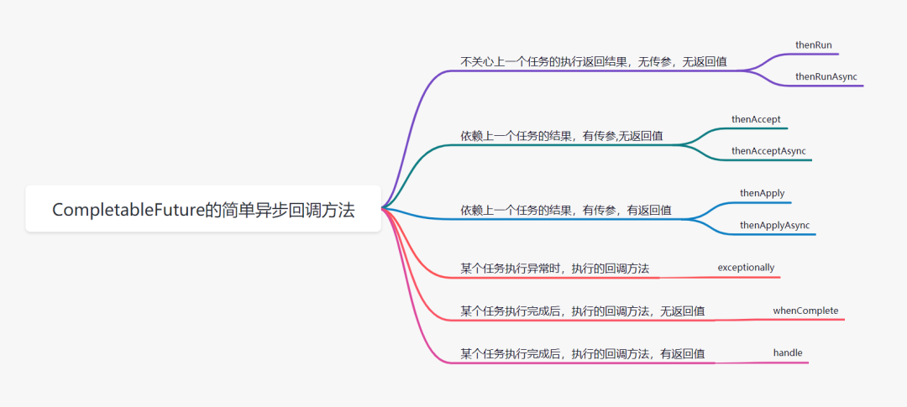

### CompletableFuture



### 实例化
```java
public static <U> CompletableFuture<U> supplyAsync(Supplier<U> supplier);
public static <U> CompletableFuture<U> supplyAsync(Supplier<U> supplier, Executor executor);

public static CompletableFuture<Void> runAsync(Runnable runnable);
public static CompletableFuture<Void> runAsync(Runnable runnable, Executor executor);
```
- 有两种格式，一种是supply开头的方法，一种是run开头的方法
  - supply开头：这种方法，可以返回异步线程执行之后的结果
  - run开头：这种不会返回结果，就只是执行线程任务

> 在实例化方法中，我们是可以指定Executor参数的，当我们不指定的试话，我们所开的并行线程使用的是默认系统及公共线程池ForkJoinPool，而且这些线程都是守护线程。我们在编程的时候需要谨慎使用守护线程，如果将我们普通的用户线程设置成守护线程，当我们的程序主线程结束，JVM中不存在其余用户线程，那么CompletableFuture的守护线程会直接退出，造成任务无法完成的问题

### 获取结果
```java
public T    get()
public T    get(long timeout, TimeUnit unit)
public T    getNow(T valueIfAbsent)
public T    join()
```

### 计算完成后续操作1——complete
```java
public CompletableFuture<T>     whenComplete(BiConsumer<? super T,? super Throwable> action)
public CompletableFuture<T>     whenCompleteAsync(BiConsumer<? super T,? super Throwable> action)
public CompletableFuture<T>     whenCompleteAsync(BiConsumer<? super T,? super Throwable> action, Executor executor)
public CompletableFuture<T>     exceptionally(Function<Throwable,? extends T> fn)
```
>方法1和2的区别在于是否使用异步处理，2和3的区别在于是否使用自定义的线程池，前三个方法都会提供一个返回结果和可抛出异常，我们可以使用lambda表达式的来接收这两个参数，然后自己处理。 方法4，接收一个可抛出的异常，且必须return一个返回值，类型与钻石表达式种的类型一样

### 计算完成后续操作2——handle
```java
public <U> CompletableFuture<U>     handle(BiFunction<? super T,Throwable,? extends U> fn)
public <U> CompletableFuture<U>     handleAsync(BiFunction<? super T,Throwable,? extends U> fn)
public <U> CompletableFuture<U>     handleAsync(BiFunction<? super T,Throwable,? extends U> fn, Executor executor)
```

>handle方法集和上面的complete方法集没有区别，同样有两个参数一个返回结果和可抛出异常，区别就在于返回值，没错，虽然同样返回CompletableFuture类型，但是里面的参数类型，handle方法是可以自定义的

```java

// 开启一个异步方法
        CompletableFuture<List> future = CompletableFuture.supplyAsync(() -> {
            List<String> list = new ArrayList<>();
            list.add("语文");
            list.add("数学");
            // 获取得到今天的所有课程
            return list;
        });
        // 使用handle()方法接收list数据和error异常
        CompletableFuture<Integer> future2 = future.handle((list,error)-> {
            // 如果报错，就打印出异常
            error.printStackTrace();
            // 如果不报错，返回一个包含Integer的全新的CompletableFuture
            return list.size();
             // 注意这里的两个CompletableFuture包含的返回类型不同
        });
```
### 计算完成的后续操作3——apply
```java
public <U> CompletableFuture<U>     thenApply(Function<? super T,? extends U> fn)
public <U> CompletableFuture<U>     thenApplyAsync(Function<? super T,? extends U> fn)
public <U> CompletableFuture<U>     thenApplyAsync(Function<? super T,? extends U> fn, Executor executor)
```
> 为什么这三个方法被称作，计算完成的后续操作2呢，因为apply方法和handle方法一样，都是结束计算之后的后续操作，
  > 唯一的不同是：handle方法会给出异常，可以让用户自己在内部处理，而apply方法只有一个返回结果，如果异常了，会被直接抛出，交给上一层处理。 如果不想每个链式调用都处理异常，那么就使用apply吧。

### 计算完成的后续操作4——accept
```java
public CompletableFuture<Void>  thenAccept(Consumer<? super T> action)
public CompletableFuture<Void>  thenAcceptAsync(Consumer<? super T> action)
public CompletableFuture<Void>  thenAcceptAsync(Consumer<? super T> action, Executor executor)
```
> accept（）三个方法只做最终结果的消费，注意此时返回的CompletableFuture是空返回。只消费，无返回，有点像流式编程的终端操作。

### 捕获中间产生的异常——exceptionally
```java
public CompletableFuture<T> exceptionally(Function<Throwable, ? extends T> fn)

```
> exceptionally() 可以帮我们捕捉到所有中间过程的异常，方法会给我们一个异常作为参数，我们可以处理这个异常，同时返回一个默认值，跟服务降级 有点像，默认值的类型和上一个操作的返回值相同。 
> **小贴士 ：向线程池提交任务的时候发生的异常属于外部异常，是无法捕捉到的，毕竟还没有开始执行任务。**