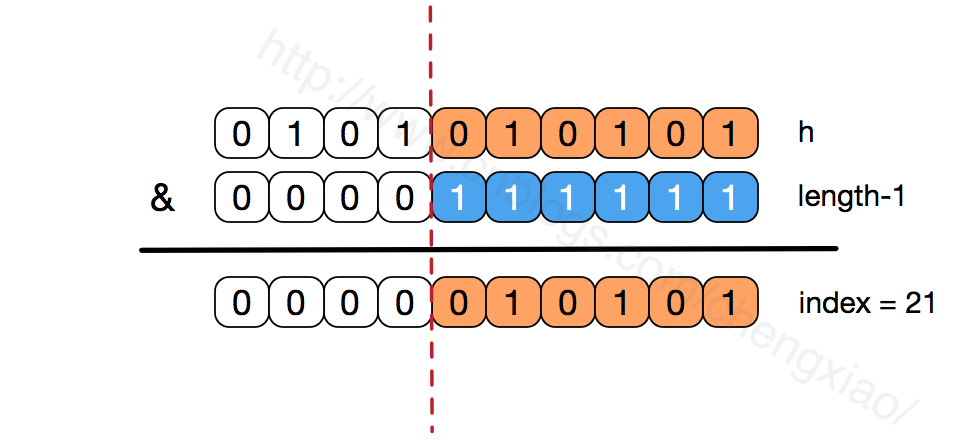

### HashMap实现原理
- HashMap的主干是一个Entry数组。Entry是HashMap的基本组成单元，每一个Entry包含一个key-value键值对。
```java

//HashMap的主干数组，可以看到就是一个Entry数组，初始值为空数组{}，主干数组的长度一定是2的次幂
transient Entry<K,V>[] table = (Entry<K,V>[]) EMPTY_TABLE;
```
####  Entry是HashMap中的一个静态内部类。代码如下
```java
static class Entry<K,V> implements Map.Entry<K,V> {
        final K key;
        V value;
        Entry<K,V> next;//存储指向下一个Entry的引用，单链表结构
        int hash;//对key的hashcode值进行hash运算后得到的值，存储在Entry，避免重复计算

        /**
         * Creates new entry.
         */
        Entry(int h, K k, V v, Entry<K,V> n) {
            value = v;
            next = n;
            key = k;
            hash = h;
        }
```

>简单来说，HashMap由数组+链表组成的，数组是HashMap的主体，链表则是主要为了解决哈希冲突而存在的，如果定位到的数组位置不含链表（当前entry的next指向null）,那么对于查找，添加等操作很快，仅需一次寻址即可；如果定位到的数组包含链表，对于添加操作，其时间复杂度为O(n)，首先遍历链表，存在即覆盖，否则新增；对于查找操作来讲，仍需遍历链表，然后通过key对象的equals方法逐一比对查找。所以，性能考虑，HashMap中的链表出现越少，性能才会越好。
```java
//实际存储的key-value键值对的个数
transient int size;
//阈值，当table == {}时，该值为初始容量（初始容量默认为16）；当table被填充了，也就是为table分配内存空间后，threshold一般为 capacity*loadFactory。HashMap在进行扩容时需要参考threshold，后面会详细谈到
int threshold;
//负载因子，代表了table的填充度有多少，默认是0.75
final float loadFactor;
//用于快速失败，由于HashMap非线程安全，在对HashMap进行迭代时，如果期间其他线程的参与导致HashMap的结构发生变化了（比如put，remove等操作），需要抛出异常ConcurrentModificationException
transient int modCount;
```
> HashMap有4个构造器，其他构造器如果用户没有传入initialCapacity 和loadFactor这两个参数，会使用默认值
> initialCapacity默认为16，loadFactory默认为0.75
##### 构造器
```java
public HashMap(int initialCapacity, float loadFactor) {　　　　　//此处对传入的初始容量进行校验，最大不能超过MAXIMUM_CAPACITY = 1<<30(230)
        if (initialCapacity < 0)
            throw new IllegalArgumentException("Illegal initial capacity: " +
                                               initialCapacity);
        if (initialCapacity > MAXIMUM_CAPACITY)
            initialCapacity = MAXIMUM_CAPACITY;
        if (loadFactor <= 0 || Float.isNaN(loadFactor))
            throw new IllegalArgumentException("Illegal load factor: " +
                                               loadFactor);

        this.loadFactor = loadFactor;
        threshold = initialCapacity;　　　　　
        init();//init方法在HashMap中没有实际实现，不过在其子类如 linkedHashMap中就会有对应实现
    }
```
##### put操作
```java
public V put(K key, V value) {
        //如果table数组为空数组{}，进行数组填充（为table分配实际内存空间），入参为threshold，此时threshold为initialCapacity 默认是1<<4(24=16)
        if (table == EMPTY_TABLE) {
            inflateTable(threshold);
        }
       //如果key为null，存储位置为table[0]或table[0]的冲突链上
        if (key == null)
            return putForNullKey(value);
        int hash = hash(key);//对key的hashcode进一步计算，确保散列均匀
        int i = indexFor(hash, table.length);//获取在table中的实际位置
        for (Entry<K,V> e = table[i]; e != null; e = e.next) {
        //如果该对应数据已存在，执行覆盖操作。用新value替换旧value，并返回旧value
            Object k;
            if (e.hash == hash && ((k = e.key) == key || key.equals(k))) {
                V oldValue = e.value;
                e.value = value;
                e.recordAccess(this);
                return oldValue;
            }
        }
        modCount++;//保证并发访问时，若HashMap内部结构发生变化，快速响应失败
        addEntry(hash, key, value, i);//新增一个entry
        return null;
    }
```

##### inflateTable
```java
private void inflateTable(int toSize) {
        int capacity = roundUpToPowerOf2(toSize);//capacity一定是2的次幂
        threshold = (int) Math.min(capacity * loadFactor, MAXIMUM_CAPACITY + 1);//此处为threshold赋值，取capacity*loadFactor和MAXIMUM_CAPACITY+1的最小值，capaticy一定不会超过MAXIMUM_CAPACITY，除非loadFactor大于1
        table = new Entry[capacity];
        initHashSeedAsNeeded(capacity);
    }
```
> inflateTable这个方法用于为主干数组table在内存中分配存储空间，通过roundUpToPowerOf2(toSize)可以确保capacity为大于或等于toSize的最接近toSize的二次幂，比如toSize=13,则capacity=16;to_size=16,capacity=16;to_size=17,capacity=32.

```java
private static int roundUpToPowerOf2(int number) {
        // assert number >= 0 : "number must be non-negative";
        return number >= MAXIMUM_CAPACITY
                ? MAXIMUM_CAPACITY
                : (number > 1) ? Integer.highestOneBit((number - 1) << 1) : 1;
    }
```
> roundUpToPowerOf2中的这段处理使得数组长度一定为2的次幂，Integer.highestOneBit是用来获取最左边的bit（其他bit位为0）所代表的数值.


#### HASH
```java

//这是一个神奇的函数，用了很多的异或，移位等运算，对key的hashcode进一步进行计算以及二进制位的调整等来保证最终获取的存储位置尽量分布均匀
final int hash(Object k) {
        int h = hashSeed;
        if (0 != h && k instanceof String) {
            return sun.misc.Hashing.stringHash32((String) k);
        }

        h ^= k.hashCode();

        h ^= (h >>> 20) ^ (h >>> 12);
        return h ^ (h >>> 7) ^ (h >>> 4);
    }
```

> 以上hash函数计算出的值，通过indexFor进一步处理来获取实际的存储位置
```java
/**
     * 返回数组下标
     */
    static int indexFor(int h, int length) {
        return h & (length-1);
    }
```

> h&（length-1）保证获取的index一定在数组范围内，举个例子，默认容量16，length-1=15，h=18,转换成二进制计算为
```text
    1  0  0  1  0
    &   0  1  1  1  1
    __________________
        0  0  0  1  0    = 2
```
> 最终计算出的index=2。有些版本的对于此处的计算会使用 取模运算，也能保证index一定在数组范围内，不过位运算对计算机来说，性能更高一些（HashMap中有大量位运算）
##### 所以最终存储位置的确定流程是这样的：

##### addEntry
```java
void addEntry(int hash, K key, V value, int bucketIndex) {
        if ((size >= threshold) && (null != table[bucketIndex])) {
            resize(2 * table.length);//当size超过临界阈值threshold，并且即将发生哈希冲突时进行扩容
            hash = (null != key) ? hash(key) : 0;
            bucketIndex = indexFor(hash, table.length);
        }

        createEntry(hash, key, value, bucketIndex);
    }
```
> 通过以上代码能够得知，当发生哈希冲突并且size大于阈值的时候，需要进行数组扩容，扩容时，需要新建一个长度为之前数组2倍的新的数组，然后将当前的Entry数组中的元素全部传输过去，扩容后的新数组长度为之前的2倍，所以扩容相对来说是个耗资源的操作

#### 为何HashMap的数组长度一定是2的次幂？
```java
void resize(int newCapacity) {
        Entry[] oldTable = table;
        int oldCapacity = oldTable.length;
        if (oldCapacity == MAXIMUM_CAPACITY) {
            threshold = Integer.MAX_VALUE;
            return;
        }

        Entry[] newTable = new Entry[newCapacity];
        transfer(newTable, initHashSeedAsNeeded(newCapacity));
        table = newTable;
        threshold = (int)Math.min(newCapacity * loadFactor, MAXIMUM_CAPACITY + 1);
    }
```
> 如果数组进行扩容，数组长度发生变化，而存储位置 index = h&(length-1),index也可能会发生变化，需要重新计算index，我们先来看看transfer这个方法

```java
void transfer(Entry[] newTable, boolean rehash) {
        int newCapacity = newTable.length;　　　　　//for循环中的代码，逐个遍历链表，重新计算索引位置，将老数组数据复制到新数组中去（数组不存储实际数据，所以仅仅是拷贝引用而已）
        for (Entry<K,V> e : table) {
            while(null != e) {
                Entry<K,V> next = e.next;
                if (rehash) {
                    e.hash = null == e.key ? 0 : hash(e.key);
                }
                int i = indexFor(e.hash, newCapacity);　　　　　　　　　 //将当前entry的next链指向新的索引位置,newTable[i]有可能为空，有可能也是个entry链，如果是entry链，直接在链表头部插入。
                e.next = newTable[i];
                newTable[i] = e;
                e = next;
            }
        }
    }
```
> 这个方法将老数组中的数据逐个链表地遍历，扔到新的扩容后的数组中，我们的数组索引位置的计算是通过 对key值的hashcode进行hash扰乱运算后，再通过和 length-1进行位运算得到最终数组索引位置。

**hashMap的数组长度一定保持2的次幂，比如16的二进制表示为 10000，那么length-1就是15，二进制为01111，同理扩容后的数组长度为32，二进制表示为100000，length-1为31，二进制表示为011111。从下图可以我们也能看到这样会保证低位全为1，而扩容后只有一位差异，也就是多出了最左位的1，这样在通过 h&(length-1)的时候，只要h对应的最左边的那一个差异位为0，就能保证得到的新的数组索引和老数组索引一致(大大减少了之前已经散列良好的老数组的数据位置重新调换)**


>  还有，数组长度保持2的次幂，length-1的低位都为1，会使得获得的数组索引index更加均匀，比如：


##### GET
```java
public V get(Object key) {　　　　 //如果key为null,则直接去table[0]处去检索即可。
        if (key == null)
            return getForNullKey();
        Entry<K,V> entry = getEntry(key);
        return null == entry ? null : entry.getValue();
 }
```
> get方法通过key值返回对应value，如果key为null，直接去table[0]处检索。我们再看一下getEntry这个方法
```java
final Entry<K,V> getEntry(Object key) {
            
        if (size == 0) {
            return null;
        }
        //通过key的hashcode值计算hash值
        int hash = (key == null) ? 0 : hash(key);
        //indexFor (hash&length-1) 获取最终数组索引，然后遍历链表，通过equals方法比对找出对应记录
        for (Entry<K,V> e = table[indexFor(hash, table.length)];
             e != null;
             e = e.next) {
            Object k;
            if (e.hash == hash && 
                ((k = e.key) == key || (key != null && key.equals(k))))
                return e;
        }
        return null;
    }
```
>get方法的实现相对简单，key(hashcode)-->hash-->indexFor-->最终索引位置，找到对应位置table[i]，再查看是否有链表，遍历链表，通过key的equals方法比对查找对应的记录。