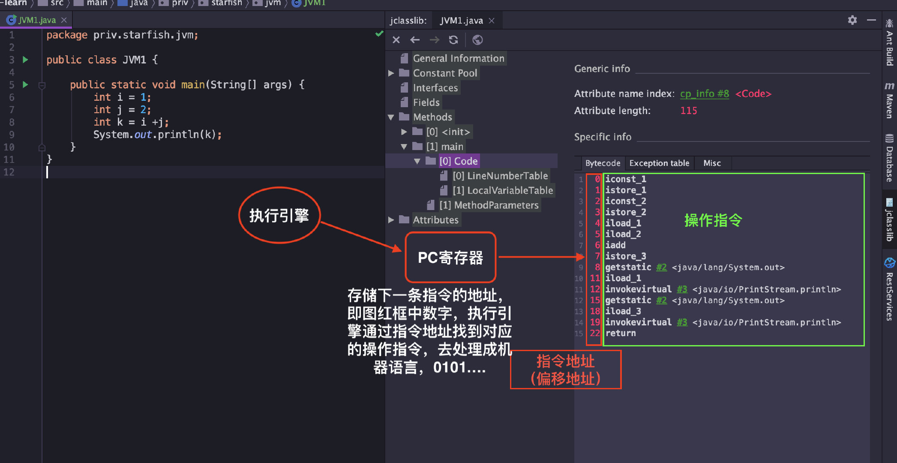

### 运行时数据区
- 内存是非常重要的系统资源，是硬盘和 CPU 的中间仓库及桥梁，承载着操作系统和应用程序的实时运行。 
- JVM 内存布局规定了 Java 在运行过程中内存申请、分配、管理的策略，保证了 JVM 的高效稳定运行。
- 不同的 JVM 对于内存的划分方式和管理机制存在着部分差异。

- Java 虚拟机定义了若干种程序运行期间会使用到的运行时数据区，其中有一些会随着虚拟机启动而创建，随着虚拟机退出而销毁。
- 另外一些则是与线程一一对应的，这些与线程一一对应的数据区域会随着线程开始和结束而创建和销毁。
  - 线程私有：程序计数器、虚拟机栈、本地方法区
  - 线程共享：堆、方法区, 堆外内存（Java7的永久代或JDK8的元空间、代码缓存）

### 程序计数器
- 程序计数寄存器（Program Counter Register），Register 的命名源于 CPU 的寄存器，寄存器存储指令相关的线程信息，CPU 只有把数据装载到寄存器才能够运行。 
- 这里，并非是广义上所指的物理寄存器，叫程序计数器（或PC计数器或指令计数器）会更加贴切，并且也不容易引起一些不必要的误会。
- JVM 中的 PC 寄存器是对物理 PC 寄存器的一种抽象模拟。 
- 程序计数器是一块较小的内存空间，可以看作是当前线程所执行的字节码的行号指示器。

#### 1.1 作用
PC 寄存器用来存储指向下一条指令的地址，即将要执行的指令代码。由执行引擎读取下一条指令

#### 1.2 概述
