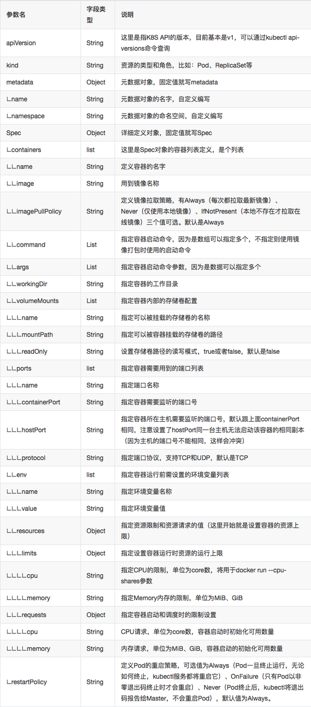

#### apiVersion: group/apiversion
    如果没有给定group名称，那么默认为croe，可以使用kubectl api-versions 获取当前k8s版本上所有的apiVersion版本信息(每个版本可能不同)

#### kind：资源类别

#### metadata：资源元数据
    name：（metadata中的name字段在同一类型中必须是唯一的）
    namespace：命名空间
    labels：标签（键值数据）
    annotations：资源注解

#### spec：资源期望的状态
#### status：当前状态，该字段由k8s集群维护，用户不能对其进行修改。

#### 各种资源通用的常用字段如下

#### spec
    spec.containers.name ： pod的名称，必须字段，名称唯一且对象创建后不可以被修改
    spec.containers.image ：镜像仓库的路径/镜像的名称( 镜像的标签 )
    spec.containers.image.imagePullPolicy ：镜像下载策略( Always：总是去仓库下载；Never：从不去仓库下载；IfNotPresent：如果本地没有就去仓库下载。默认是"IfNotPresent" 但是，如果镜像的标签是latest，则总会是"Always，并且对象一旦被创建，这个字段不允许被改变）
    spec.containers.ports：容器公开的端口列表。在这里公开端口可以为系统提供关于容器使用的网络连接的额外信息，但主要是提供信息。在这里不指定端口不会阻止该端口被公开。任何监听容器内默认的“0.0.0.0”地址的端口都可以从网络访问
    spec.containers.ports.containerPort：暴露的端口，此端口仅是额外的信息，对端口是否被暴露没有影响
    spec.containers.ports.hostPort：主机上公开的端口
    spec.containers.ports.protocol：端口的协议
    spec.containers.ports.hostIP：指定要绑定的主机
    spec.containers.command：运行的程序，类似于docker中的entrypiont,并且这里的命令不会运行在shell中，如果没有这个字段docker镜像会运行自己entrypiont中的指令
    spec.containers.args：向docker镜像中传递参数 如果定义了这个字段，docker镜像中cmd命令不会被执行，如果引用变量使用$(VAR_NAME)格式引用，如果想使用命令引用的的方式，需要使用$$(VAR_NAME)方式来引用
    spec.containers.volumeMounts.mountPath：可以被容器挂载的存储卷的路径，路径不能包含':' 符号
    spec.containers.volumeMounts.subPath：可以被容器挂载的存储卷的路径，并且不会覆盖挂载点中的文件
    spec.containers.volumeMounts.readOnly：是否只读，默认为false
    spec.containers.resources.limits：资源限制
    spec.containers.resources.limits.cpu ：CPU 上限， 可以短暂超过， 容器也不会被停止
    spec.containers.resources.limits.memory：内存上限， 不可以超过； 如果超过， 容器可能会被终止或调度到其他资源充足的机器上
    spec.containers.resources.requests：资源需求
    spec.containers.resources.requests.cpu：CPU 请求， 也是调度 CPU 资源的依据， 可以超过
    spec.containers.resources.requests.memory：内存请求， 也是调度内存资源的依据， 可以超过； 但如果超过， 容器可能会在 Node内存不足时清理。
    spec.nodeSelector：指定对象的调度节点,节点必须存在。
    spec.restartPolicy：容器的重启策略。有三种Always(只要退出就重启)，OnFailure(状态为错误时重启)，Never(从不重启)，kubelet重新启动的已退出容器将以指数退避延迟（10秒，20秒，40秒......）重新启动，上限为五分钟，并在成功执行十分钟后重置